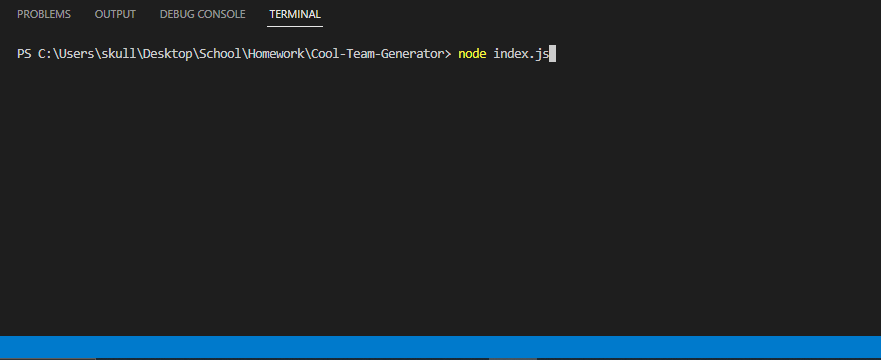

# Cool-Team-Generator

## Description

I wanted to make this project so I can help my coworkers make better team websites to show off thier skills!
I learned alot about linking multiple files together to make 1 action.

## Table of Contents

Link To Video: https://drive.google.com/file/d/1p6n8Qr0NGwuHOcY76U-n5-1RYVV5OTmV/view?usp=sharing

- [Installation](#installation)
- [Usage](#usage)
- [Credits](#credits)
- [License](#license)

## Installation

All you need to do is open up the Terminal and type "node index.js" and if you want to watch the Demonstration Video then click the link in the Table of Contents

## Usage

To run the code you need to put "node index.js" here, in the Terminal

## Credits

https://www.w3schools.com/bootstrap4/bootstrap_containers.asp

## License

MIT License

Copyright (c) [2022] [JustinSnyder]

Permission is hereby granted, free of charge, to any person obtaining a copy
of this software and associated documentation files (the "Software"), to deal
in the Software without restriction, including without limitation the rights
to use, copy, modify, merge, publish, distribute, sublicense, and/or sell
copies of the Software, and to permit persons to whom the Software is
furnished to do so, subject to the following conditions:

The above copyright notice and this permission notice shall be included in all
copies or substantial portions of the Software.

THE SOFTWARE IS PROVIDED "AS IS", WITHOUT WARRANTY OF ANY KIND, EXPRESS OR
IMPLIED, INCLUDING BUT NOT LIMITED TO THE WARRANTIES OF MERCHANTABILITY,
FITNESS FOR A PARTICULAR PURPOSE AND NONINFRINGEMENT. IN NO EVENT SHALL THE
AUTHORS OR COPYRIGHT HOLDERS BE LIABLE FOR ANY CLAIM, DAMAGES OR OTHER
LIABILITY, WHETHER IN AN ACTION OF CONTRACT, TORT OR OTHERWISE, ARISING FROM,
OUT OF OR IN CONNECTION WITH THE SOFTWARE OR THE USE OR OTHER DEALINGS IN THE
SOFTWARE.